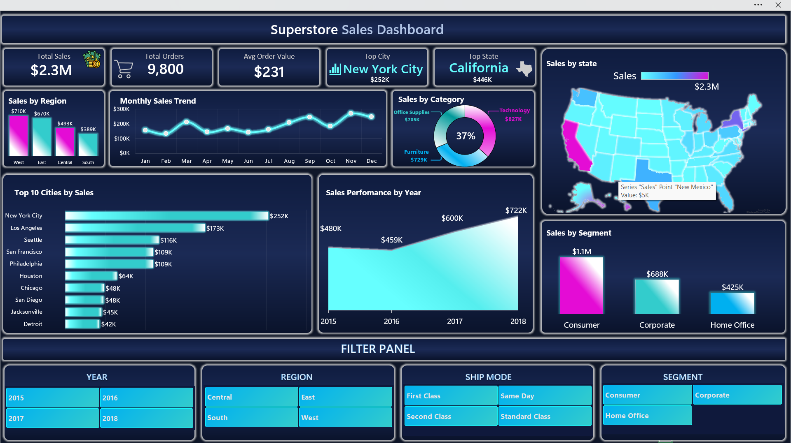

# E-Commerce Sales Analysis using Excel & SQL

An end-to-end data analytics project focused on analyzing e-commerce sales performance using Microsoft Excel and SQL.  
This project explores customer behavior, regional performance, product category trends, and sales growth patterns through data cleaning, SQL analysis, pivot tables, and interactive dashboard visualization.

---

# Table of Contents

- [Overview](#overview)
- [Business Problem](#business-problem)
- [Dataset](#dataset)
- [Tools & Technologies](#tools--technologies)
- [Project Structure](#project-structure)
- [Data Cleaning & Preparation](#data-cleaning--preparation)
- [SQL Analysis](#sql-analysis)
- [Dashboard & Visualization](#dashboard--visualization)
- [Key Insights](#key-insights)
- [Recommendations](#recommendations)
- [How to Use](#how-to-use)
- [Author](#author)

---

# Overview

This project analyzes e-commerce sales data using Microsoft Excel and SQL to identify business trends, customer purchasing behavior, regional sales performance, and category-level insights.

The project demonstrates a complete data analytics workflow including:

- Data Cleaning
- Data Preparation
- SQL Query Analysis
- Pivot Table Reporting
- Interactive Dashboard Development
- Business Recommendations

The objective of this project is to transform raw sales data into actionable business insights that support data-driven decision-making.

---

# Business Problem

The primary business problem addressed in this project is:

> How can an e-commerce business use historical sales data to improve sales performance, understand customer behavior, and identify growth opportunities?

Business Questions:

- Which regions generate the highest revenue?
- Which product categories perform best?
- Which customer segments contribute the most sales?
- What are the monthly and yearly sales trends?
- Which states and cities are top-performing?
- Which shipping modes are most frequently used?

---

# Dataset

Dataset: Superstore Sales Dataset  
Source: Kaggle  
Format: CSV  
Records: Approximately 9,800 rows

Dataset includes:

- Order Dates
- Ship Dates
- Sales Revenue
- Customer Segments
- Product Categories
- Regions & States
- Cities
- Shipping Modes

---

# Tools & Technologies

- Microsoft Excel  
  - Data Cleaning  
  - Data Preparation  
  - Pivot Tables  
  - Excel Functions & Formulas  
  - Dashboard Creation  
  - Data Visualization  

- SQL  
  - Aggregate Functions  
  - GROUP BY  
  - ORDER BY  
  - CASE Statements  
  - Joins  
  - Filtering & Sorting  
  - Business Analysis Queries  

- Excel Dashboard  
  - KPI Cards  
  - Interactive Charts  
  - Slicers & Filters  
  - Trend Analysis  
  - Regional Sales Analysis  
  - Category Performance Visualization  

- GitHub  
  - Project Documentation  
  - Version Control  
  - Portfolio Showcase  
# Project Structure

```text
ecommerce-sales-analysis-sql-excel/
│
├── data/
│   ├── raw/
│   └── cleaned/
│
├── sql/
│   └── ecommerce_sales_queries.sql
│
├── dashboard/
│   └── ecommerce_dashboard.xlsx
│
├── reports/
│   └── E_Commerce_Sales_Data_Analysis_Report.pdf
│
└── README.md
```

---

# Data Cleaning & Preparation

Data cleaning and preprocessing were performed using Microsoft Excel before conducting SQL analysis and dashboard creation.

Cleaning steps included:

- Removing duplicate records
- Standardizing date formats
- Handling missing values
- Organizing and formatting columns
- Validating numeric data types
- Standardizing categorical values
- Creating calculated columns for analysis

Additional columns created:

- Year
- Month Name
- Month Number
- Quarter
- Shipping Days
- Order Count

These transformations improved reporting accuracy and dashboard visualization.

---

# SQL Analysis

More than 30 SQL queries were written and executed to analyze the dataset.

Analysis Performed:

- Sales by Region
- Sales by Category
- Customer Segment Analysis
- Monthly Sales Trends
- Yearly Sales Growth
- Top Performing States
- Top Performing Cities
- Shipping Mode Analysis

# Dashboard & Visualization

An interactive Excel dashboard was developed to visualize business performance and key metrics.

Dashboard Components:

- KPI Cards
- Sales by Region
- Monthly Sales Trend
- Sales by Category
- Sales by Segment
- Top Cities by Sales
- State-Level Sales Analysis
- Yearly Performance Charts

Dashboard Features:

- Interactive Filters
- Region Selection
- Year Filters
- Segment Filters
- Ship Mode Filters

## Dashboard Preview

Add your dashboard screenshot here:

```markdown
## Dashboard Preview



---

# Key Insights

- Total sales exceeded approximately $2.3 Million
- Consumer segment generated the highest revenue
- Technology was the top-performing category
- California and New York were the best-performing states
- Q4 (October–December) showed peak sales performance
- Sales demonstrated consistent year-over-year growth

---

# Recommendations

Based on the analysis, the following recommendations are suggested:

- Increase marketing efforts in high-performing regions
- Focus on customer retention strategies for the Consumer segment
- Expand inventory and promotions for Technology products
- Launch seasonal campaigns during Q4
- Improve sales performance in low-performing regions
- Develop promotional strategies during low-sales months

---

# How to Use

1. Clone or download the repository
2. Open the cleaned dataset from the `data/cleaned/` folder
3. Run SQL queries from the `sql/` folder
4. Explore the dashboard file inside the `dashboard/` folder
5. Review the complete business report in the `reports/` folder

---

# Author

## Muhammad Siddique Malik

Aspiring Data Analyst | Computational Finance Student

GitHub: https://github.com/MuhammadSiddique67

---

This project is for educational and portfolio purposes only.
